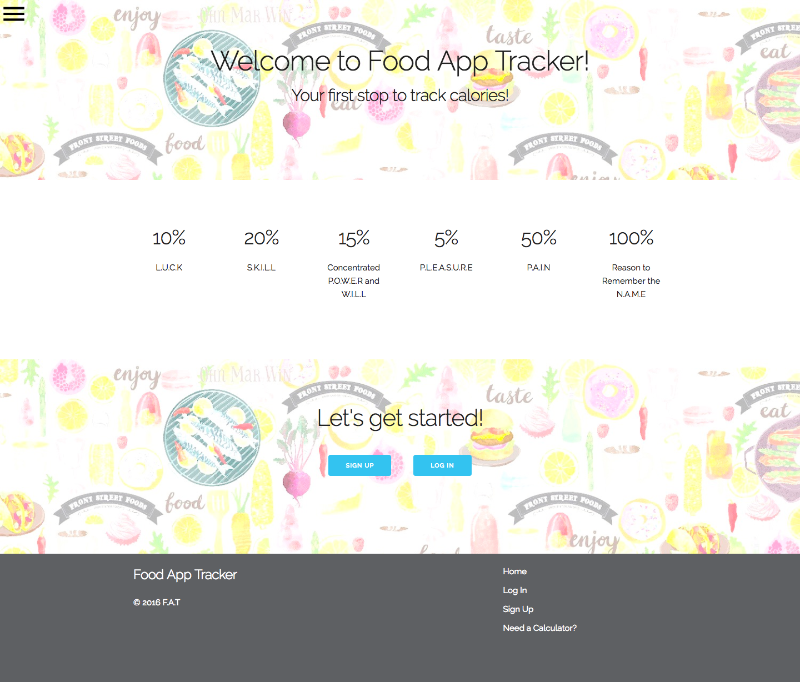
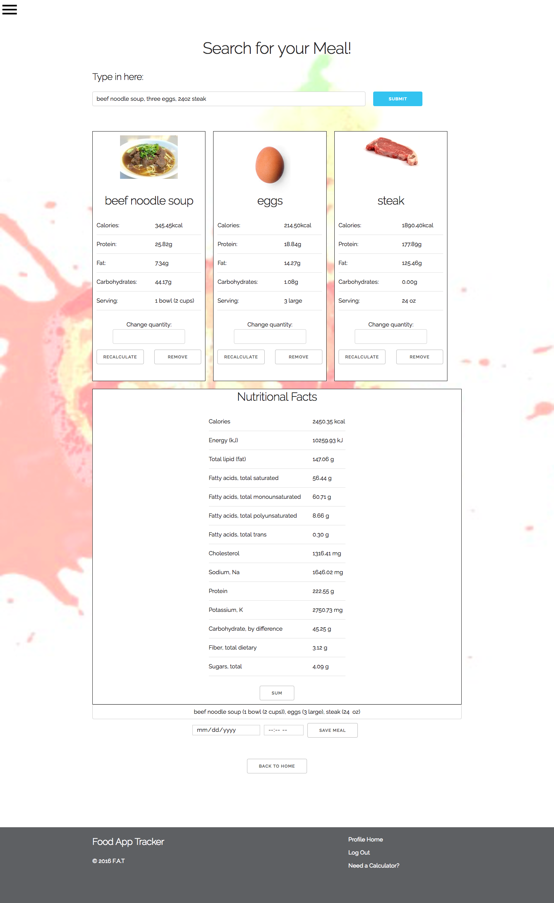
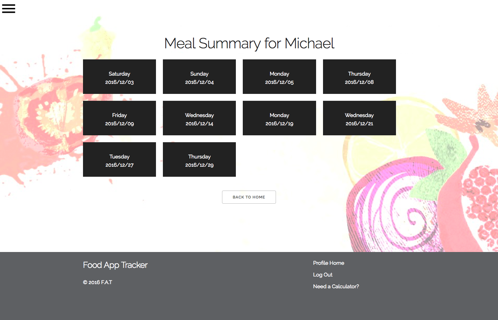
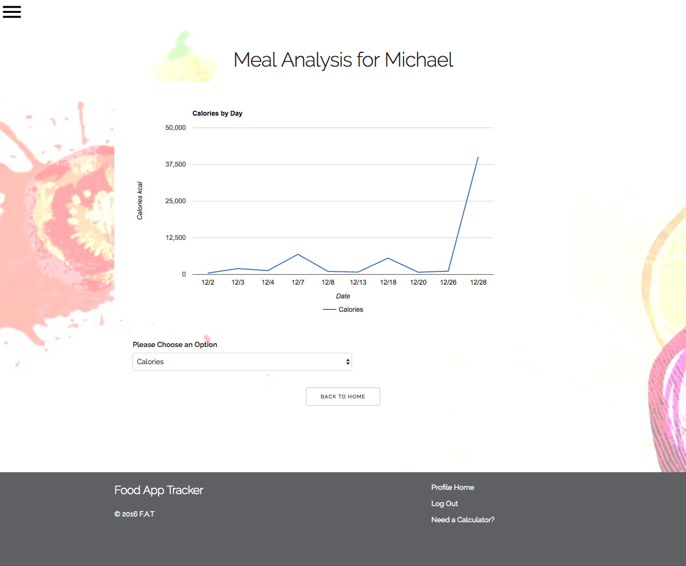

# [Food App Tracker](https://food-tracker-app.herokuapp.com/)

Food App Tracker is a web app that does two things:
1) It helps user easily keep a detailed record of their food intake.
2) It provides easily understood, detailed nutritional analysis, so that users can easily see where their diet might benefit from tweaking.

Future updates are going to expand on this functionality and streamline the user experience.

F.A.T. uses ReactJS, PostgreSQL (Knex), Express, Brunch, Axios and Skeleton.

## Technologies Used

* ReactJS
* NodeJS
* PostgreSQL
* Brunch

### Please submit any feedback or bugs in Issues! Any feedback is welcome!
